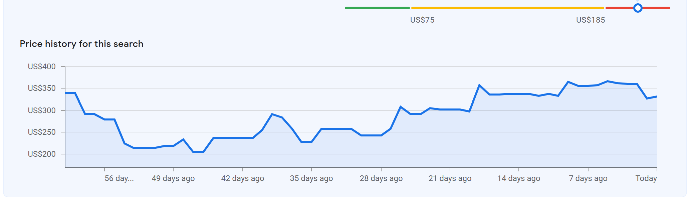

# Flight Search Agent

An intelligent flight search tool that uses GPT to parse natural language queries and searches Google Flights via SerpAPI. Results are filtered, ranked, and exported to Excel for easy comparison.


*Example: Track flight price changes over time to find the best deals*

## Features

- **Natural Language Parsing**: Describe your trip in plain English; GPT extracts all search parameters.
- **Smart Query Caching**: Hashes your query text to reuse previous LLM parses, saving OpenAI API costs and time.
- **Smart Search Expansion**: Automatically generates multiple search combinations from date ranges and airport alternatives.
- **Flexible Filtering**: Post-filter results by airline, max stops, layover airports, and more.
- **Response Caching**: Avoid redundant API calls with configurable cache TTL.
- **Usage Tracking**: Monitor your monthly SerpAPI call usage.
- **Excel Export**: Get organized results in a spreadsheet with pricing, duration, airlines, and booking links.

## Installation

1. **Clone the repository**
   ```bash
   git clone https://github.com/yourusername/flightSearch.git
   cd flightSearch
   ```

2. **Create a virtual environment**
   ```bash
   python -m venv .venv
   .venv\Scripts\activate  # Windows
   # or
   source .venv/bin/activate  # macOS/Linux
   ```

3. **Install dependencies**
   ```bash
   pip install -r requirements.txt
   ```

4. **Set up environment variables**
   
   Create a `.env` file in the project root:
   ```env
   OPENAI_API_KEY=your_openai_api_key_here
   SERPAPI_API_KEY=your_serpapi_api_key_here
   ```

   Get your API keys:
   - OpenAI: https://platform.openai.com/api-keys
   - SerpAPI: https://serpapi.com/manage-api-key

## Usage

### Basic Usage

1. Create or edit `query.txt` in the project root with your flight search request:
   ```text
   round trip from SFO to JFK or EWR, non stop flights only
   departing range between 10 May evening and reaching New York by May 12 morning
   returning between May 18 after 10AM and reaching by May 20 8AM
   At least one flight should be JetBlue
   2 adults and 1 kid (aged 7)
   sort by cheapest
   ```

2. Run the search:
   ```bash
   python -m flight_search
   ```

3. Find your results in a timestamped Excel file (e.g., `flights_2026-02-22_092821.xlsx`).

### Advanced Usage

```bash
# Use a custom query file
python -m flight_search my_vacation.txt

# Disable response caching
python -m flight_search --no-cache

# Force fresh GPT parse (ignore cached parse)
python -m flight_search --reparse

# Combine options
python -m flight_search my_trip.txt --no-cache --reparse
```

## Query Examples

### Simple Round Trip
```text
Round trip from NYC to LAX
Departing March 15, returning March 22
2 adults
```

### Flexible Dates with Filters
```text
one way from Boston to San Francisco
departing between June 1-5
1 adult, 1 child (age 8)
nonstop only
max price $400
sort by duration
```

### Multiple Airports
```text
round trip from JFK, EWR, or LGA to LAX or BUR
departing April 10, returning April 17
business class
1 adult
exclude United and American
```

### Time-Specific Requirements
```text
round trip from Chicago to Miami
departing March 20 after 6PM
returning March 27 before 2PM
2 adults
at least one leg must be on Delta
```

## Configuration

Edit `src/flight_search/config.py` to customize:

- `SERPAPI_CACHE_TTL_HOURS`: Cache response lifetime (default: 6 hours)
- `SERPAPI_MONTHLY_LIMIT`: Your SerpAPI plan limit (default: 100)
- `MAX_COMBINATIONS`: Safety limit for query expansion (default: 50)
- `DEFAULT_QUERY_FILE`: Default input file (default: query.txt)

## How It Works

1. **Parse**: GPT-4 analyzes your natural language query and extracts:
   - Origin/destination airports (with alternatives)
   - Date ranges and time constraints
   - Passenger counts and ages
   - Filters (stops, airlines, price, duration)
   - Ranking preference
   *(The parsed result is hashed and cached so identical queries don't require re-prompting the LLM).*

2. **Expand**: The parser generates all necessary search combinations:
   - Each date in a range becomes a separate search
   - Airport alternatives are expanded into individual searches
   - Estimated API call count is shown before execution

3. **Fetch**: Queries are sent to SerpAPI's Google Flights endpoint:
   - Responses are cached locally to save API calls
   - Monthly usage is tracked and displayed
   - Combination explosion protection prevents accidental overuse

4. **Filter**: Post-processing applies filters that SerpAPI doesn't support:
   - Required/excluded airlines on specific legs
   - Maximum layover time or excluded layover airports
   - Custom leg-specific constraints

5. **Rank**: Results are sorted by your preference:
   - Price (default)
   - Duration
   - Departure/arrival times
   - Emissions

6. **Export**: Formatted Excel file includes:
   - Flight details (times, airlines, duration, stops)
   - Pricing breakdown
   - Direct booking link
   - Combination metadata

## Project Structure

```text
flightSearch/
├── src/
│   └── flight_search/
│       ├── __main__.py          # Entry point and orchestration
│       ├── config.py            # Configuration constants
│       ├── llm_parser.py        # GPT query parsing
│       ├── flight_fetcher.py    # SerpAPI integration
│       ├── result_processor.py  # Filtering and ranking
│       ├── excel_exporter.py    # Excel output generation
│       └── models.py            # Pydantic data models
├── query.txt                    # Default query file
├── requirements.txt             # Python dependencies
├── .env                         # API keys (create this)
└── README.md                    # This file
```

## API Costs

- **OpenAI**: ~$0.001-0.005 per query (GPT-5.2)
- **SerpAPI**: Free tier includes 250 searches/month; paid plans start at $50/month

The tool tracks and displays your SerpAPI usage to help you stay within limits.

## Why SerpAPI?

We use SerpAPI's Google Flights API because direct access to airline pricing data (via GDS systems like Amadeus or Sabre) is notoriously difficult and expensive for individual developers to obtain. Scraping Google Flights directly is also highly complex due to dynamic rendering and bot protection. SerpAPI provides a reliable, structured JSON wrapper around Google Flights, giving us access to the most comprehensive flight aggregator available with a generous free tier (250 calls/month).

## Limitations

- Requires valid OpenAI and SerpAPI API keys.
- SerpAPI results reflect Google Flights data availability.
- Some advanced filters (e.g., specific layover airports) are applied post-fetch.
- Multi-city trips are not fully supported yet.

## Contributing

Pull requests are welcome. For major changes, please open an issue first to discuss what you would like to change.

## License

[MIT](LICENSE)

## Acknowledgments

- [SerpAPI](https://serpapi.com/) for Google Flights data access
- [OpenAI](https://openai.com/) for GPT-4 natural language parsing
